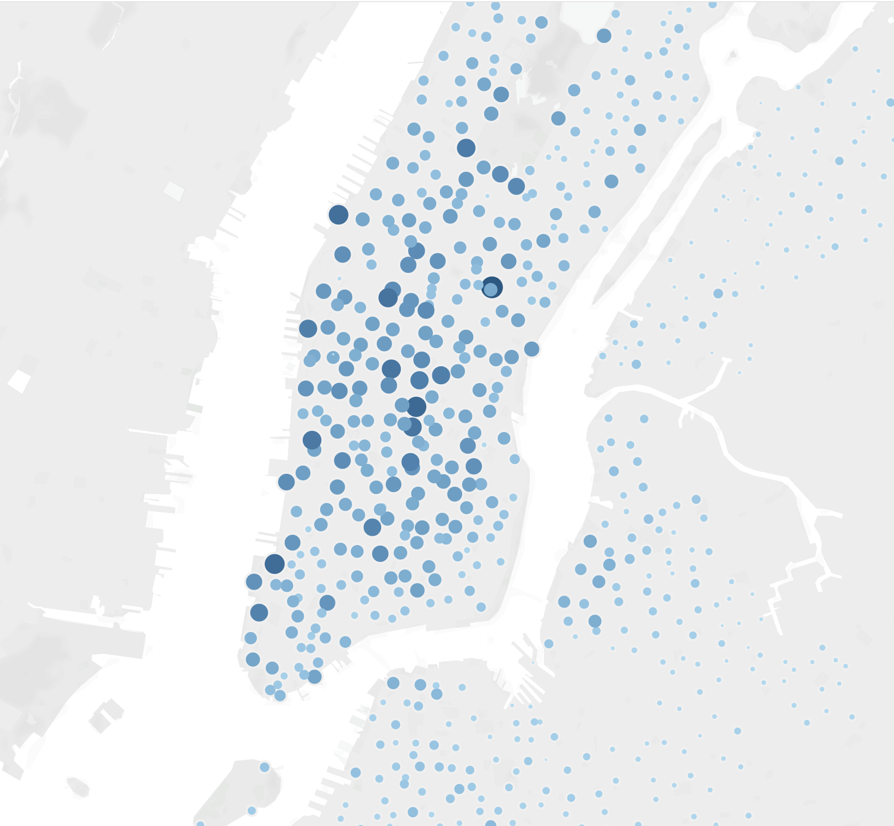
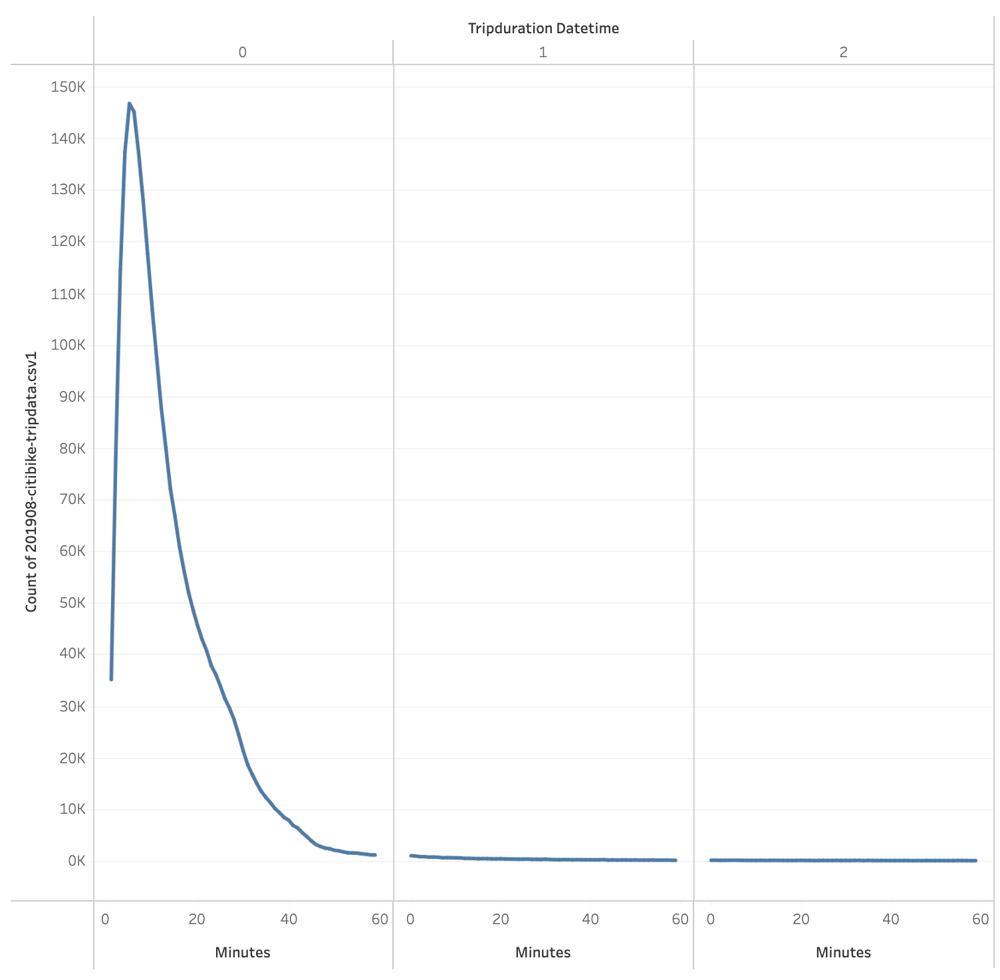
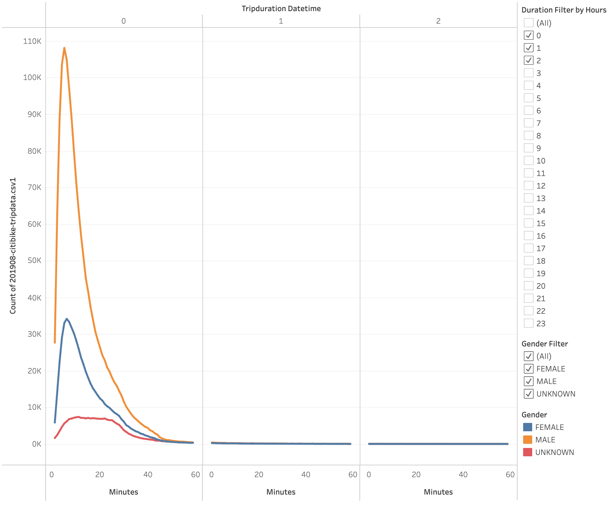
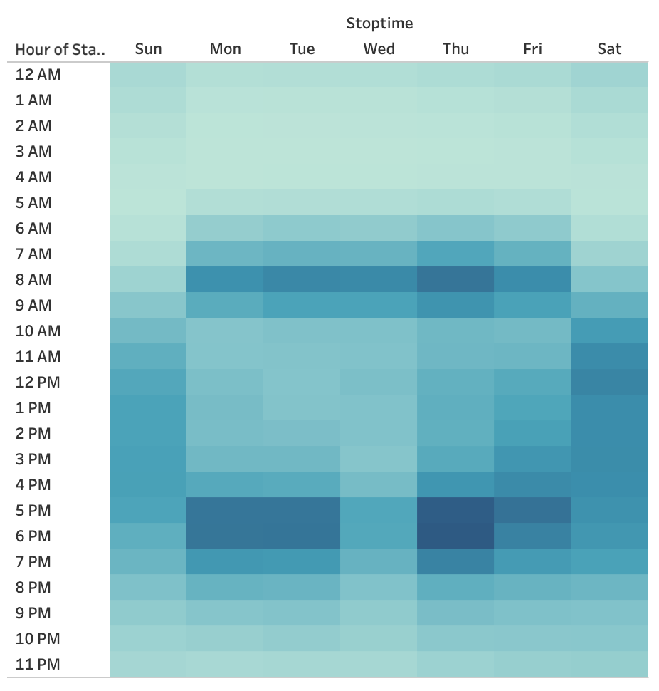
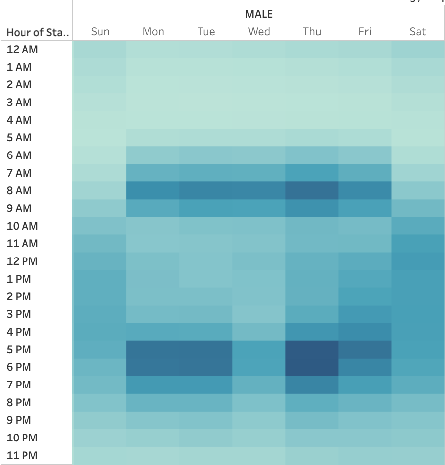
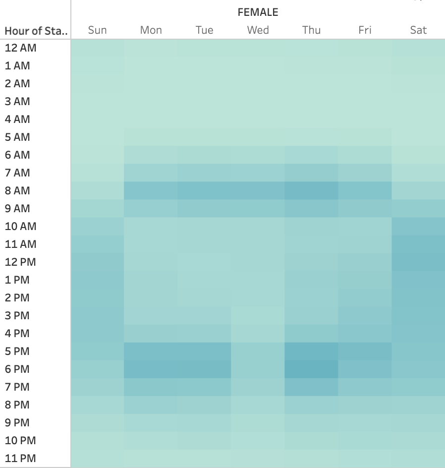
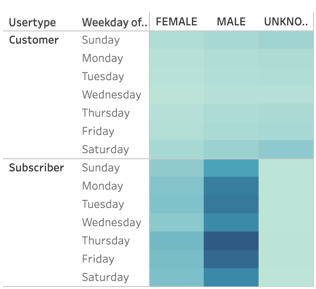
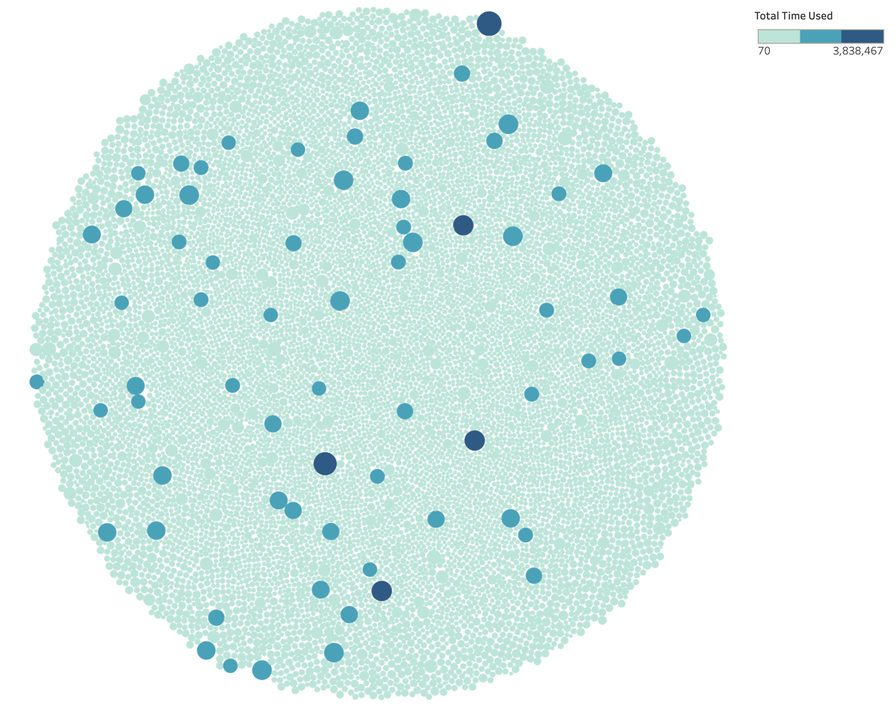

# Bikesharing Analysis

# Overview

The purpose of this analysis was to analyze bikesharing patterns in NYC and determine the viability of establishing bikesharing in Des Moines.

# Results

## Top Starting Locations

The following graph shows starting locations for bike trips across and outside Manhattan, with the number of trips beginning at a particular location signified by color hue intensity and marker size. The most popular starting locations tend to be in central and southern Manhattan, near the most densely populated urban areas and tourist attractions.

## Trip Duration

This graph visualizes trip duration subdivided by hour. Almost all trips last less than one hour, with the largest share each lasting about 5 minutes.

Dividing the data by gender shows that trips by male users and trips by female users have similar peaks, while trips by users of unknown gender are more spread out up to just under 30 mintutes. This suggests that users whose gender is unrecorded either don't usually need to take shorter trips, or opt to walk for shorter trips isntead.

## Trips by Hour and Weekday

The following heatmap shows bike trips by starting hour across weekdays. As can be seen, most trips occur on weekdays, 7-10AM and 4-8PM. Weekends see a wider spread, with trips seeing an upswing around 9AM that lasts until about 8PM. Saturdays tend to see more trips than Sundays.

Filtering weekday trips by gender, we see confirmation of the pattern, and that the bulk of ridership comes from male users.

The graph for female users shows the same pattern, though rides by female users number less than those by male users.

A look at the same graph for users of unknown gender slightly suggests a similar pattern to male and female users.

Dividing the data by user type (i.e., customer or subscriber) shows that subscribers take the vast majority of trips. Additionally, since it is the only gender category with more customer trips than subscriber trips, users whose gender is unrecorded may be infrequent users or may overall be hesitant to have any of their information recorded.

## Bike Utilization

As a final note, the following graph visualizes the total duration of time each bike in the program was used, with duration being represented by color hue intensity as well as marker size. The graph shows that a small number of bikes are used far more heavily than the rest, suggesting that bikes that need maintenance can be easily removed from rotation.

# Summary

The analysis has found that in NYC, bikesharing usership comes primarily from male users, likely for the purpose of commuting to and from work. Trips tend to begin in the most densely populated areas of Manhattan and areas with tourist attractions. Bike utilization is concentrated on a small subset of bikes which makes bike maintenance easier to perform, especially during ridership downtimes.

Additional visualizations that could prove useful:
- Trip duration/number of trips against age, and user type against age, to get a better sense of who primary users are
- Trip starting locations against ending locations, to see how far bikes tend to travel, and where popular bike paths may be relative to each other.
